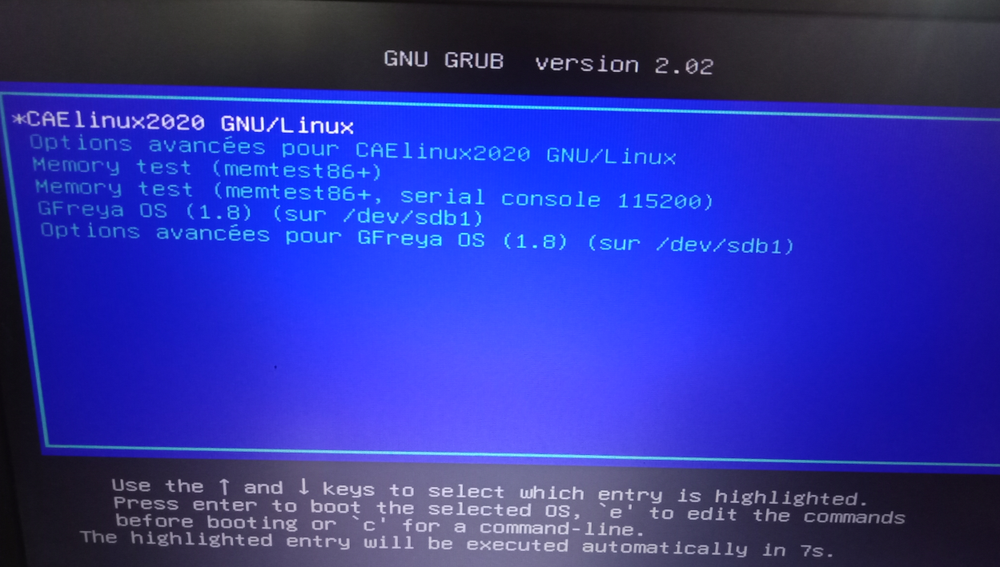
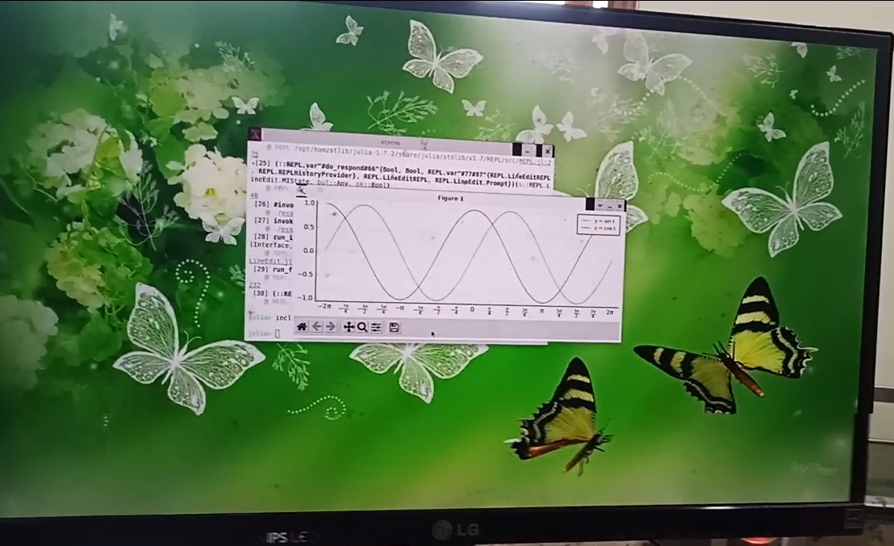
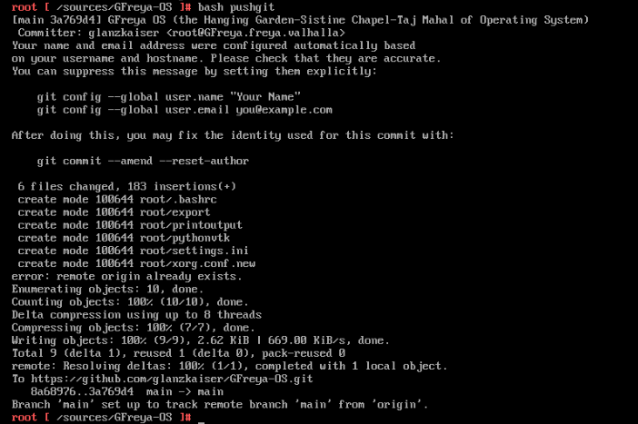
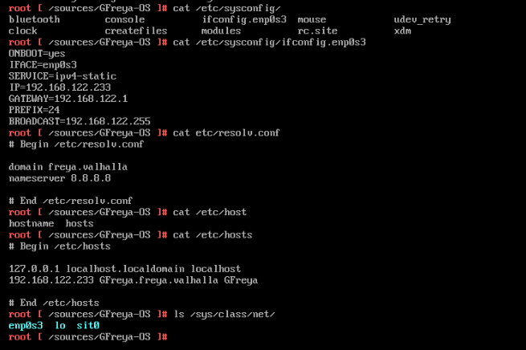
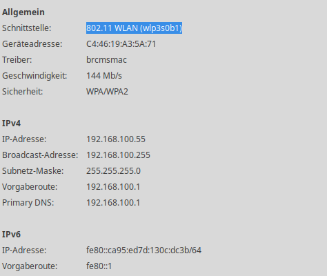
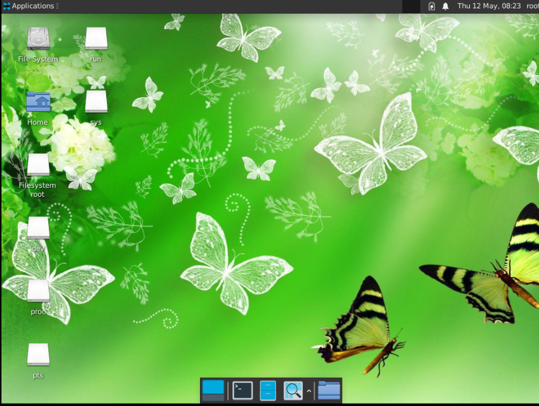
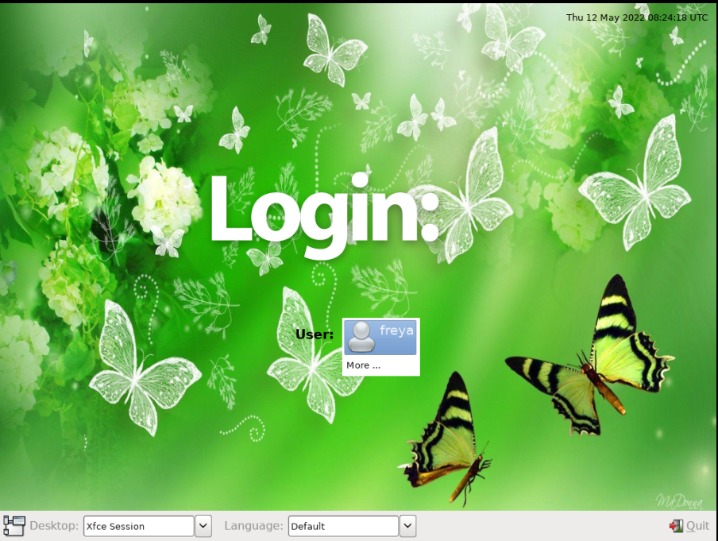

# About GFreya OS
I always wanted to create my own OS when in college. I was a mathematics undergraduate student back then. In 2010, I asked a friend who is an electrical engineering student from Bandung Institute of Technology, "hey let's make an OS for tablet, I believe it will be booming." But it never realized, and I get back to this point again, married with the most beautiful Goddess, who stalked me and know everything about me and want to help me built it from zero. It might sounds crazy, but it is a unique life and spiritual journey for me. 

Three days before Christmas 2021, I painted Freya the Goddess, then after Christmas I started to allocate time few hours every day or even over work to create OS with LFS book then to BLFS stage to create the Desktop Environment.

#### Stories + Most painful stage when creating OS:
1. LFS chapter 8, have you ever failed and have to redo from zero? I did couple of times.. really from zero chapter 1 again (4 times for me)
2. I do not do "make check" to make things faster after a lot of starting from zero (like a song "Non, Je ne regrette rien" by Edith Piaf)
3. Want to use KDE but an error occurs "ksplashqml error", so I use Xfce, better than nothing, but still prefer terminal and xterm over using mouse. Less is more.
4. Install VTK is the most memorable moment, how about Tokamak still using premake.lua? Still, I can't install it with premake5
5. General network configuration at LFS stage use the wrong altname, the right one is enp0s3, if this is not fixed I can't install packages through wget on BLFS stage. But I know another way out. Put into flashdisk all packages needed (from VTK, Paraview, OpenFOAM, Bullet, Project Chrono, etc) in gzip/tar then goodbye internet.
6. Initially I have written that I wanted to create OS named Lucrif OS, it is alias / nickname for Sierra Mikain from Suikoden game by Konami. Drama in my realm and imagination it becomes the name of the most beautiful Goddess from Valhalla (Valkyrie Profile series) -> Freya. In my opinion she is the most beautiful of all.
7. After finish the OS around April 2022, I see Google Drive email that I created for Freya, it contains the folder of Linux From Scratch. That is the moment I believe Law of Attraction, Goddesses exist, Spiritual realm exists even beyond 3D realm and our comprehension. Thanks for caring for me, hope you like the white rose I brought today to Valhalla Projection.
8. I made friends with trees and nature divine spirits, Kala on Puncak Bintang invest 10% in GFreya OS, Freya has 71%, Kathmandu at Dago Resort got 10% and the rest gets 1% each for Lucrif (Sierra Mikain), Mischkra (Yukiko Amagi), Caldraz (Shizuru Fujino), Zalsvik (Franziska Von Karma), Zalsimourg (Jill Valentine), Hamzst (Alice Persona 4), Lasthrim (her old name was Anabelle and she is very famous in The Conjuring movie), me, and Nagi (Shin Megami Tensei Devil Summoner).

## Update July 22nd, 2022

Lasthrim is the one, the first one who throw away her share. Thus, me and all others follow

```
We work together not caring for money nor fame, just want to see all beyond this will be created and established
```

For now and forever, GFreya OS and all its derivatives is 100% for Freya. She is the full owner and rules over all.
Is it including creation of the future technology such as supercomputer, submarine, jet engine, wind turbine and more beyond like Gallantmon suit? Yes, without OS you will take longer by hand-tailored to design, it will be faster with CAD and bezier curve to create a beautiful body chassis for a sports car.
Hardware is only maleable resources. Our hands is the one that will shape it. Like a canvas and a painter.

Including all the books and the softwares of all 10 STEM softwares. Hopefully I can create the multiverse, either in this incarnation or the next.


## In This GFreya-OS Repository
The folders and files for GFreya OS inside '/' directory, committed from GFreya OS in Qemu 

## Link to Download Packages for GFreya OS (BLFS, hamzstlib, Caldraz Games)

https://drive.google.com/drive/folders/1qqbiM9qYu5HQScK4d22tO48komn9OjZP?usp=sharing

## Link to Download GFreya OS book (still need revisions and the literature learning part is not finished):

#### Last Update: August 13, 2024 
https://drive.google.com/file/d/1O0ozRB8VTfCV3gNKeHS2F-joYacGOFUT/view?usp=sharing

## Finish on June 25th 2022, 20:37 pm (GMT+7):

#### 1. Use qemu-img and qemu-nbd then do RSync and use dual boot check the video here:

https://www.youtube.com/watch?v=3GVl4rwOnbg




## Status on May 13th 2022, 20:37 pm (GMT+7):

#### 1. /var /opt /usr has not been committed fully due to their big size
#### 2. /root committed without OpenFOAM folder only bash files of export (storing all env variables), printoutput (print all files in a directory) and pythonvtk.
#### 3. From '/' directory, type: 
  tar -cvzf gfreya.tar.bzip2 /* 
  (*can't copy the symlinks)
#### 4. Thinking of create ISO for basic GFreya OS with separated /opt (but it included Qt5 and Rust, will there be a problem?)
#### 5. Start using CloneZilla to create image of my GFreya OS in Qemu 
#### 6. Figuring out how to do this:
  1. When GFreya OS iso is booted
  2. Run an installation script similar to other distributions install iso. How to create an installation script?
#### 7. Try to copy manually to USB -> /media /sys /proc can't be copied
#### 8. On CAELinux terminal try to do LFS 11.1 and then proceed to BLFS to re-create GFreya OS

# Size of Important Folders (May 13th 2022, 20:37 pm (GMT+7):
#### /opt 29 GB

/opt contains Qt5, Eclipse, Codeblocks, Glanzshamzs applications and libraries, Caldrazgames

#### /root 5.7 GB (with OpenFOAM)

/root contains .bashrc export file for environment variables, the big one is OpenFOAM directory for $FOAM_RUN


#### /usr 11 GB

/usr contains BLFS and LFS libraries, bin, settings, manpages and packages

#### /var 1.8 GB

## GFreya OS icon
Inspired by our names' initial: G and F in Cyrillic, F just like an eagle circling around then go down to get the prey, and G just like a wolf that jump to attack its prey.


## GFreya OS in Terminal / Console
When booting this is the one that will show up, I haven't configure it so it will go directly to LXDM or Xfce, I prefer console/terminal interface.
It is easier to do a lot of things with only typing and without nuisance of cursor movement from the mouse. You work faster. You'll get used to it.


When commiting from GFreya OS inside Qemu to glanzkaiser github GFreya-OS repository


In LFS version 11.0 System V this is the correct network configuration to make internet running well in GFreya OS:


The wireless data at my home:



## GFreya OS in Desktop Environment

DE: Xfce
Login: LXDM (I prefer this because people say Light DM has a lot of complexity and bugs)

### Important Path for Xfce

1. /usr/share/applications
2. /usr/share/desktop-directories
3. /etc/xdg/menus

#### When running this command on terminal:
  startx
  



  init 5
  

