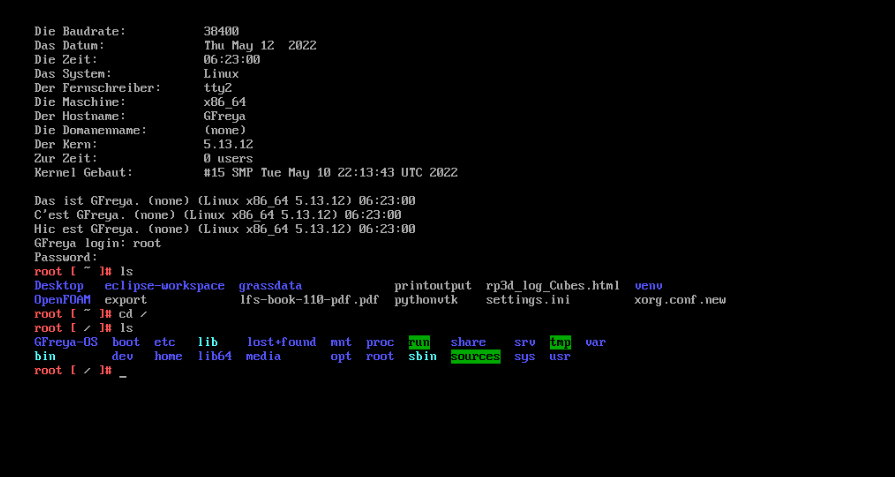
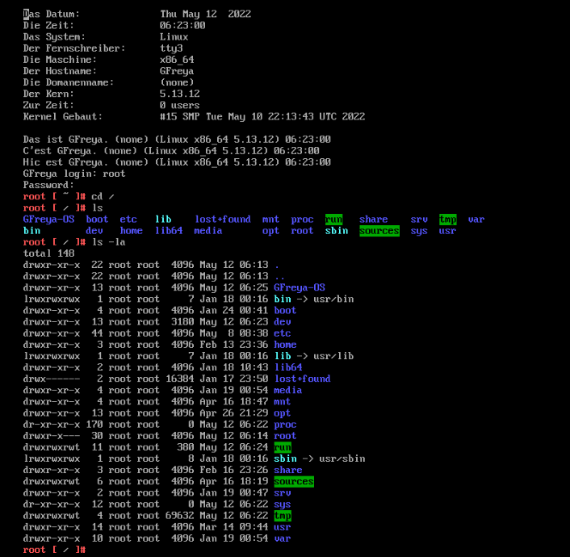
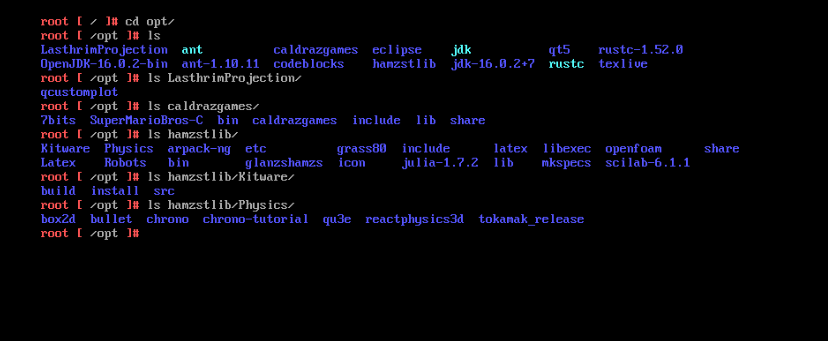
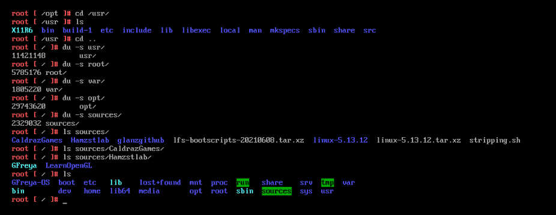

# GFreya-OS
The folders and files for GFreya OS, committed from GFreya OS in Qemu 

# Status / Latest commit:
#### /var /root /opt /usr has not been committed due to their big size

#### /opt 29 GB
#### /root 5.7 GB
#### /usr 11 GB
#### /var 1.8 GB

/opt contains Qt5, Eclipse, Codeblocks, Glanzshamzs applications and libraries, Caldrazgames

/root contains .bashrc export file for environment variables, the big one is OpenFOAM directory for $FOAM_RUN

/usr contains BLFS and LFS libraries, bin, settings, manpages and packages

/var contains 

#### /proc can't be copied

#### May 12th 13:10 pm (GMT+7)

